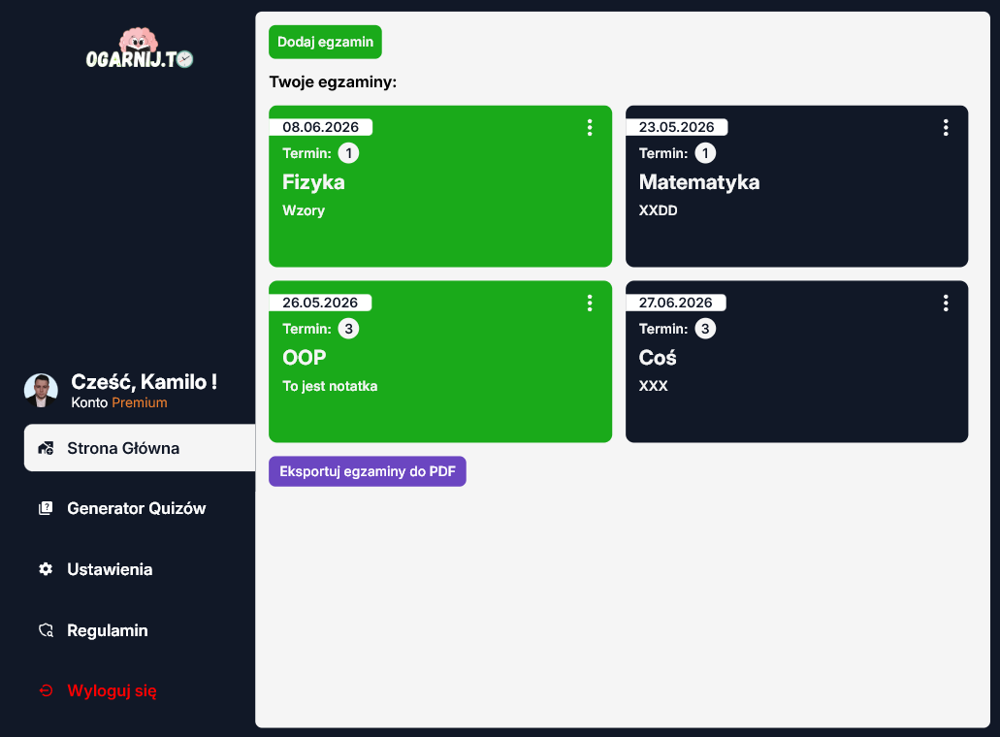
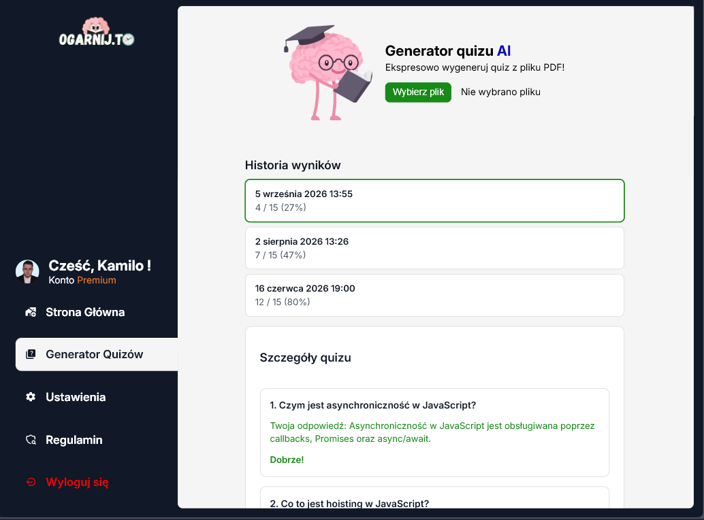
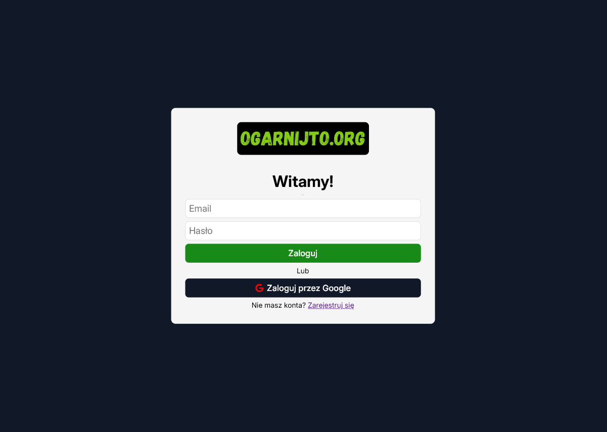

# Ogarnijto.org — Student Web Application with AI Assistant

A full-stack web platform for students to manage exams, generate AI-powered quizzes from PDF materials, and unlock Premium features through secure payments.
---

## Screenshots

### Exam dashboard
Central hub for tracking exams — add, edit, complete, and export schedules to PDF.



### AI Quiz Generator
Upload a PDF, generate interactive quizzes with OpenAI, and review past results with detailed answer breakdowns.



### Authentication
Email/password and Google OAuth login powered by Supabase Auth.



---

## Features

| Module | Description |
|--------|-------------|
| **Exam management** | CRUD operations, completion tracking, term labels, notes, PDF export |
| **AI Quiz Generator** | PDF text extraction, OpenAI-powered question generation, interactive quiz UI, score history |
| **Authentication** | Supabase Auth (email + Google OAuth), protected routes, session persistence |
| **Premium billing** | Stripe Payment Intents, BLIK/card/P24 support, webhook-based subscription activation |
| **User settings** | Custom display name, public profile toggle, persisted across logins |
| **Email reminders** | Scheduled exam reminders via Nodemailer (cron jobs) |

---

## Tech Stack

### Frontend (`/client`)
- **React 19** + **TypeScript** + **Vite**
- **Redux Toolkit** — global state (auth, exams, quiz results, user profile)
- **React Router v7** — client-side routing
- **Supabase JS** — authentication
- **Stripe.js** — payment checkout
- **pdf.js** — PDF parsing for quiz generation
- **jsPDF** — exam schedule export
- Plain CSS design system with shared UI components

### Backend (`/server`)
- **Node.js** + **Express**
- **MySQL** — relational data storage
- **Supabase** — JWT verification middleware
- **OpenAI API** — quiz generation
- **Stripe** — payments & webhooks
- **Nodemailer** + **node-cron** — automated email reminders

---

## Architecture

```
┌─────────────────────────────────────────────────────────┐
│                     React Client (Vite)                  │
│  Pages · Redux Store · Feature modules · UI components   │
└──────────────────────────┬──────────────────────────────┘
                           │ REST API (JSON)
┌──────────────────────────▼──────────────────────────────┐
│                  Express Server (Node.js)                  │
│     Auth middleware · CRUD · Stripe · OpenAI · Cron      │
└──────────┬──────────────────────────────┬───────────────┘
           │                              │
    ┌──────▼──────┐                ┌──────▼──────┐
    │    MySQL    │                │  Supabase   │
    │   Database  │                │    Auth     │
    └─────────────┘                └─────────────┘
```

---

## Project Structure

```
Web-Application-for-students-with-AI-assistant/
├── client/                  # React frontend
│   ├── src/
│   │   ├── components/      # Shared UI (Button, Sidebar, forms, cards)
│   │   ├── features/        # Domain logic (auth, billing, exams, quizzes)
│   │   ├── pages/           # Route-level views
│   │   ├── services/        # API clients
│   │   └── store/           # Redux configuration
│   └── package.json
├── server/                  # Express backend
│   ├── server.js            # API routes, middleware, cron jobs
│   └── lib/                   # Supabase client
├── docs/
│   └── screenshots/         # Application screenshots
└── README.md
```

---

## Getting Started

### Prerequisites

- Node.js 18+
- MySQL database
- [Supabase](https://supabase.com/) project (Auth)
- [Stripe](https://stripe.com/) account (Payments — optional for Premium)
- [OpenAI](https://openai.com/) API key (Quiz generation)

### 1. Clone the repository

```bash
git clone https://github.com/<your-username>/Web-Application-for-students-with-AI-assistant.git
cd Web-Application-for-students-with-AI-assistant
```

### 2. Backend setup

```bash
cd server
npm install
```

Create a `.env` file in `/server`:

```env
PORT=8081
DB_HOST=localhost
DB_PORT=3306
DB_USER=your_user
DB_PASSWORD=your_password
DB_DATABASE=ogarnijto

SUPABASE_URL=your_supabase_url
SUPABASE_SERVICE_ROLE_KEY=your_service_role_key

STRIPE_SECRET_KEY=your_stripe_secret_key
STRIPE_PUBLISHABLE_KEY=your_stripe_publishable_key
STRIPE_WEBHOOK_SECRET=your_webhook_secret

OPENAI_API_KEY=your_openai_api_key
FRONTEND_URL=http://localhost:5173

EMAIL_USER=your_gmail
EMAIL_PASS=your_app_password
```

```bash
npm start
```

### 3. Frontend setup

```bash
cd client
npm install
```

Create a `.env` file in `/client`:

```env
VITE_SERVER_URL=http://localhost:8081
VITE_SUPABASE_URL=your_supabase_url
VITE_SUPABASE_ANON_KEY=your_supabase_anon_key
```

```bash
npm run dev
```

Open [http://localhost:5173](http://localhost:5173).

---

## Available Scripts

| Location | Command | Description |
|----------|---------|-------------|
| `client/` | `npm run dev` | Start Vite dev server |
| `client/` | `npm run build` | Production build |
| `client/` | `npm test` | Run Vitest tests |
| `server/` | `npm start` | Start API with nodemon |

---

## API Overview

| Method | Endpoint | Description |
|--------|----------|-------------|
| `POST` | `/save-user` | Sync user profile on login |
| `GET` | `/getUser` | Fetch authenticated user |
| `GET/POST/PUT/DELETE` | `/exams` | Exam CRUD |
| `POST` | `/generate-quiz` | AI quiz generation from text |
| `POST/GET` | `/quiz-result(s)` | Save and fetch quiz scores |
| `POST` | `/create-payment-intent` | Stripe checkout |
| `PUT` | `/user/settings` | Update profile settings |

Protected routes require a Supabase `Bearer` token in the `Authorization` header.

---

## Highlights for Reviewers

- **Full-stack ownership** — end-to-end feature delivery from database schema to UI
- **Real third-party integrations** — Supabase, Stripe, OpenAI
- **Structured frontend** — feature-based modules, Redux async thunks, reusable component library
- **Security-conscious API** — JWT middleware, user-scoped database queries
- **Polish UX** — responsive layout, toast notifications, loading states, accessible forms

---

## License

This project was built for educational and portfolio purposes.
